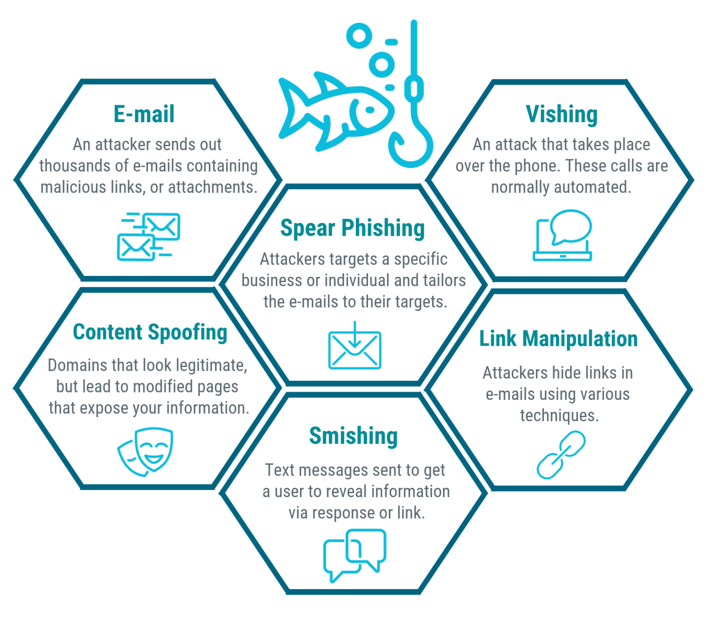

#  Course 1: Foundations of Cybersecurity

## About This Course
This course covers the core vocabulary of cybersecurity, the transferable/technical skills an analyst needs, the most common attack types and threat actors, the frameworks/controls/compliance landscape, the ethics that guide security decisions, and the everyday tools analysts use.

I learned that cybersecurity is the practice of ensuring the confidentiality, integrity, and availability of information by protecting networks, devices, people, and data from unauthorized access or criminal exploitation. This course introduced me to the terminology, mindset, and foundational knowledge used across the cybersecurity profession.

---

## Certificate of completion

  

---

## What I Learned

## 1. What Cybersecurity Actually Means

Before this course, I thought of "cybersecurity" mostly as antivirus software and firewalls. What I now understand is that cybersecurity is really the **practice of protecting the confidentiality, integrity, and availability (CIA)** of an organization's data - across its networks, devices, people, and processes, from unauthorized access or exploitation.

  

That CIA framing matters because it's the lens through which almost everything else in the course makes sense:
- **Confidentiality** - only the right people can see the data.
- **Integrity** - the data hasn't been tampered with.
- **Availability** - the data/systems are there when legitimate users need them.

Every control, framework, and law discussed later in the course is ultimately trying to protect one (or more) of these three pillars.

### Core terms I needed to internalize

| Term | My understanding |
|---|---|
| **Security posture** | An organization's overall ability to defend its assets and respond to change - basically, "how ready are we?" |
| **Security framework** | A structured guideline for building a plan to reduce risk (identify goals → set guidelines → implement processes → monitor results). |
| **Security control** | A specific safeguard (technical or procedural) used *within* a framework to reduce a particular risk. Frameworks are the "plan," controls are the individual "tools" that execute the plan. |
| **Compliance** | Following internal standards and external laws/regulations - this is what keeps an organization out of legal and financial trouble. |
| **Threat actor** | Any person or group that poses a security risk - not always external; sometimes internal. |
| **Internal threat** | A current/former employee, vendor, or partner who is a risk - sometimes accidental (e.g., clicking a phishing link), sometimes intentional. |
| **Network security** vs **Cloud security** | Network security protects on-premise infrastructure; cloud security protects assets hosted on remote servers (data centers) accessed over the internet. As more companies move to the cloud, this second one is becoming just as critical as traditional network security. |

**Example that made this click for me:** an employee accidentally clicking a malicious email link is an *internal threat*, but the email itself was sent by an *external threat actor* using *phishing*. This showed me that "internal vs external" is about **who caused the exposure**, not who the attacker is.

---

## 2. Skills an Analyst Actually Needs

I found it useful that the course separated skills into two buckets, because it reframed cybersecurity as *not purely technical* - a lot of the job is human.

### Transferable skills
These aren't cybersecurity-specific, but they're what actually make an analyst effective day to day:

- **Communication** - translating a technical finding into something a non-technical stakeholder can act on.
- **Problem-solving** - recognizing attack patterns and picking the most efficient (not necessarily "perfect") fix.
- **Time management** - triaging: not every alert is equally urgent.
- **Growth mindset** - the threat landscape changes constantly, so continuous learning isn't optional.
- **Diverse perspectives** - different backgrounds catch different blind spots in a security plan.

### Technical skills
These require tool- and procedure-specific knowledge:

| Skill/Tool | Why it matters |
|---|---|
| Programming (Python, SQL) | Automates repetitive tasks like scanning domain lists or querying a database, cutting down manual effort and human error. |
| SIEM tools | Collect and analyze log data so an analyst isn't manually sifting through thousands of log entries. |
| Intrusion Detection Systems (IDS) | Monitor activity and flag possible intrusions in near real time. |
| Threat landscape knowledge | Staying current on attacker tactics (e.g., a new ransomware variant) so defenses evolve alongside attacks. |
| Incident response | Following a defined process when something *does* go wrong, rather than improvising under pressure. |

**My takeaway:** technical tools give an analyst *scale* (a SIEM can process what a human can't), while transferable skills give an analyst *judgment* (deciding what the SIEM's alerts actually mean and what to do about them). Neither works well without the other.

---

## 3. Common Attacks and Why They Work

  

### Phishing (the human-targeted email/message attacks)

| Type | How it works |
|---|---|
| Business Email Compromise (BEC) | Impersonates a known/trusted source to request money or information. |
| Spear phishing | Targets a specific person or group, appearing to come from someone they trust. |
| Whaling | Spear phishing aimed specifically at executives. |
| Vishing | Voice-based version - phone calls impersonating a trusted source. |
| Smishing | Same idea, via text message. |

### Malware (malicious software)

| Type | Key distinguishing feature |
|---|---|
| Virus | Needs a user to trigger it (opening an attachment); then spreads within that system. |
| Worm | Self-replicates and spreads across a network **without** user action - this is the key contrast with a virus. |
| Ransomware | Encrypts an organization's data and demands payment to unlock it. |
| Spyware | Silently collects information (emails, texts, location) without consent. |

### Social engineering (exploiting people, not code)

Social media phishing, watering hole attacks, USB baiting, and physical social engineering (impersonating an employee/vendor to get physical access) all fall under this umbrella. What ties them together is that they don't exploit a technical vulnerability - they exploit **human trust**.

The course broke down *why* these work so well, and this was one of the more eye-opening parts for me:

- **Authority** - people obey figures who seem to be "in charge."
- **Intimidation** - bullying/pressure tactics.
- **Consensus/social proof** - "everyone else already gave me access."
- **Scarcity** - implying limited availability to force quick decisions.
- **Familiarity** - building a fake relationship over time.
- **Trust** - an emotional bond exploited later.
- **Urgency** - rushing the victim so they skip their normal judgment.

**Example connecting this to real life:** a "CEO fraud" BEC email works because it stacks *authority* (looks like it's from a senior exec) with *urgency* ("I need this wire transfer done in the next hour"). Recognizing that combination is often a faster red flag than trying to spot a technical fault in the email itself.

### Other attack categories (mapped to CISSP domains)

The course also tied attack types to the **8 CISSP security domains**, which helped me see that "attacks" aren't a random list - they're organized by *which part of the security program they threaten*.

| Attack type | Example forms | CISSP domain |
|---|---|---|
| Password attack | Brute force, rainbow table | Communication & Network Security |
| Social engineering | Phishing, vishing, smishing, BEC | Security & Risk Management |
| Physical attack | Malicious USB cable/drive, card skimming | Asset Security |
| Adversarial AI | AI/ML manipulated to attack more efficiently | Comm. & Network Security + Identity & Access Mgmt |
| Supply-chain attack | Vulnerability introduced via a third-party vendor | Multiple domains |
| Cryptographic attack | Birthday, collision, downgrade | Communication & Network Security |

---

## 4. Who's Behind the Attacks - Threat Actors

  

| Actor type | Motivation |
|---|---|
| Advanced Persistent Threats (APTs) | Well-resourced, research targets in advance, can stay undetected for a long time; go after critical infrastructure or IP. |
| Insider threats | Abuse *authorized* access - sabotage, corruption, espionage, or leaks. |
| Hacktivists | Politically motivated - demonstrations, propaganda, social change. |
| New/unskilled threat actors | Often just experimenting or seeking revenge, using existing malware/scripts rather than original tools. |

And a separate classification for **hackers** based on ethics/legality:

- **Authorized (ethical) hackers** - follow the law, conduct sanctioned risk evaluations.
- **Semi-authorized hackers** - researchers who find vulnerabilities but don't exploit them.
- **Unauthorized (unethical) hackers** - break the law for financial or malicious gain.

**Why this distinction matters to me:** it reframes "hacker" as a neutral term describing a *skillset*, not a moral category. The ethics come from *what they do with it* - which sets up the whole "ethics in cybersecurity" section later in the course.

---

## 5. Frameworks, Controls & Compliance - How They Fit Together

This was the section where I had to slow down the most, because the three terms (framework / control / compliance) sound similar but play very different roles:

- A **framework** is the overall *plan* (four core steps: identify goals → set guidelines → implement processes → monitor results).
- **Controls** are the individual *safeguards* used to execute that plan.
- **Compliance** is proof that you're actually following external laws/regulations - and it's what keeps the organization out of legal/financial trouble.

I think of it like building code for a house: the *framework* is the blueprint, *controls* are the actual materials and locks installed, and *compliance* is passing inspection against the legal building code.

### Key frameworks, standards, and regulations I learned

| Name | Focus area |
|---|---|
| **NIST CSF / RMF** | U.S. voluntary frameworks for managing cybersecurity risk broadly. |
| **CIS Controls** | Nonprofit-provided, actionable safeguards to strengthen defense posture. |
| **GDPR** | E.U. regulation protecting resident data/privacy - breach notification required within **72 hours**. |
| **PCI DSS** | International standard for securely handling credit card data. |
| **HIPAA** | U.S. law protecting patient health information (PHI); governed by Privacy, Security, and Breach Notification rules. |
| **HITRUST** | Framework/assurance program that helps organizations meet HIPAA compliance. |
| **ISO** | International standards for technology, manufacturing, and management. |
| **SOC 1 / SOC 2** | Auditing reports assessing an organization's user-access policies and financial/data-safety compliance. |
| **FERC-NERC** | U.S./North American regulation for organizations tied to the power grid. |
| **FedRAMP** | Standardizes security assessment for U.S. federal cloud services. |

**Why I'll remember HIPAA's 72-hour rule specifically:** it's a concrete, testable number that shows compliance isn't abstract - there are real deadlines with real consequences if a breach isn't reported in time.

---

## 6. Ethics - The Decisions Behind the Technology

This section reframed cybersecurity for me as **not just a technical discipline but a legal and ethical one.**

### Counterattacks aren't allowed (mostly)

- **In the U.S.**, counterattacking a threat actor is illegal under laws like the Computer Fraud and Abuse Act (1986) - it's treated as vigilantism, and it can escalate the situation or trigger international consequences if the actor is state-sponsored. Only approved government/military personnel can do it.
- **Internationally**, the ICJ allows a counterattack only under narrow conditions (it must target only the original attacker, be a direct request to stop, not escalate, and be reversible). In practice, organizations avoid it because those conditions are very hard to guarantee.

**My interpretation:** this is essentially the same logic as physical self-defense law - you can defend, but retaliating in a way that goes beyond stopping the immediate threat crosses into a different (and punishable) category of action.

### Core ethical obligations

- **Confidentiality** as an ethical principle - respecting privacy, not just enforcing it technically.
- **Privacy protection** - distinguishing between:
  - **PII** (Personally Identifiable Information): name, phone number - anything that can identify someone.
  - **SPII** (Sensitive PII): SSNs, credit card numbers - subject to stricter handling.
- **Legal obligation** - remaining unbiased, transparent, evidence-based, and continuously improving one's own skills to keep up with the threat landscape.

**Example tying it together:** HIPAA isn't just "a law I have to follow" - it's also an *ethical* commitment, because failing to notify a patient of a breach of their PHI isn't only illegal, it directly harms a real person's privacy and safety.

---

## 7. Tools of the Trade

| Tool | Purpose |
|---|---|
| **SIEM** (Security Information & Event Management) | Collects and analyzes log data, reducing the manual burden of reviewing logs and providing alerts via dashboards. Can be cloud-hosted (easier to set up) or on-premise. |
| **Network protocol analyzer (packet sniffer)** | Captures and analyzes network traffic data. |
| **Playbooks** | Manuals detailing the exact steps to take for a specific operational task, such as incident response. |
| **Programming (Python, SQL)** | Automates repetitive analyst tasks and lets analysts query/manage databases directly. |
| **Operating systems (Linux, macOS, Windows)** | The interface between hardware and user; Linux specifically is open-source and command-line driven. |
| **Antivirus / anti-malware software** | Scans for and removes malware. |
| **IDS** | Monitors packets and system activity for possible intrusions. |
| **Encryption** | Converts readable plaintext into unreadable ciphertext - protects confidentiality even if data is intercepted. |
| **Penetration testing** | Simulated attacks used to proactively find vulnerabilities before a real attacker does. |

### Playbooks in practice - a scenario that made this concrete for me

The course used a forensic-investigation scenario (a medical practice breach being investigated for an insurance claim) to show two playbooks working together:

1. **Chain of custody playbook** - documents who has possession of the evidence, and when, at every step, so nothing about the evidence's integrity can be challenged later.
2. **Protecting and preserving evidence playbook** - governs how to handle *volatile* digital evidence (data that can be lost if a device powers off), following the **order of volatility** to prioritize what must be preserved first. In practice, this means working from copies of the evidence, never the original, so the investigation itself doesn't corrupt the data.

**This stuck with me** as it's the clearest example in the course of *why* process (not just tools) matters, even perfect technical evidence is useless in an investigation if it wasn't handled correctly.

---

## Skills Gained

- Vocabulary and mental models for core cybersecurity concepts (CIA triad, frameworks vs. controls vs. compliance)
- Ability to classify attacks (phishing, malware, social engineering) and map them to relevant CISSP domains
- Understanding of threat actor types and their motivations
- Familiarity with major compliance standards (NIST, GDPR, HIPAA, PCI DSS, ISO, SOC, FedRAMP, FERC-NERC)
- Awareness of the legal/ethical boundaries around counterattacks and data privacy (PII/SPII)
- Working knowledge of entry-level analyst tools: SIEM, IDS, packet sniffers, playbooks, encryption, penetration testing
- Recognition of both transferable (communication, problem-solving) and technical (Python, SQL) skills needed in the field

## Key Learnings and Understandings

- Cybersecurity protects the **confidentiality, integrity, and availability** of data across networks, devices, and people.
- **Frameworks** set the plan, **controls** execute it, and **compliance** proves it's being followed legally.
- Attacks generally exploit either a **technical gap** (malware, cryptographic attacks) or **human trust** (phishing, social engineering) - and social engineering is effective because of principles like authority, urgency, and scarcity.
- **Threat actors** range from unskilled opportunists to state-level APTs, and "hacker" itself is a neutral term defined by intent, not skill.
- Major regulations (GDPR, HIPAA, PCI DSS) exist to protect specific categories of sensitive data, each with its own scope and consequences.
- **Counterattacking is illegal in the U.S.** and tightly restricted internationally - defense, not retaliation, is the standard.
- Entry-level analysts rely on a consistent toolkit: SIEM for log analysis, IDS for intrusion detection, playbooks for consistent incident response, and encryption/pen testing to proactively reduce risk.

## Conclusion

Going through this course reframed cybersecurity for me from "a technical IT specialty" to something closer to a **cross-disciplinary risk-management practice** - one that blends technical tooling (SIEM, IDS, encryption, programming) with human factors (social engineering, communication, ethics) and legal/regulatory obligations (HIPAA, GDPR, PCI DSS). The recurring thread through every topic - attacks, controls, ethics, tools is the **CIA triad**; everything either protects confidentiality, integrity, or availability, or it's a gap that a threat actor can exploit. That single lens is what I'll carry forward into the rest of this certificate program.
