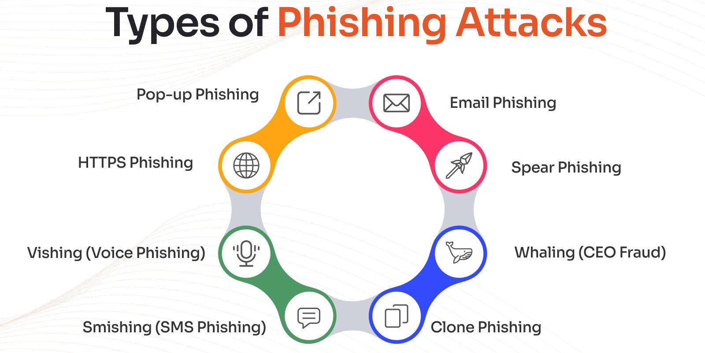
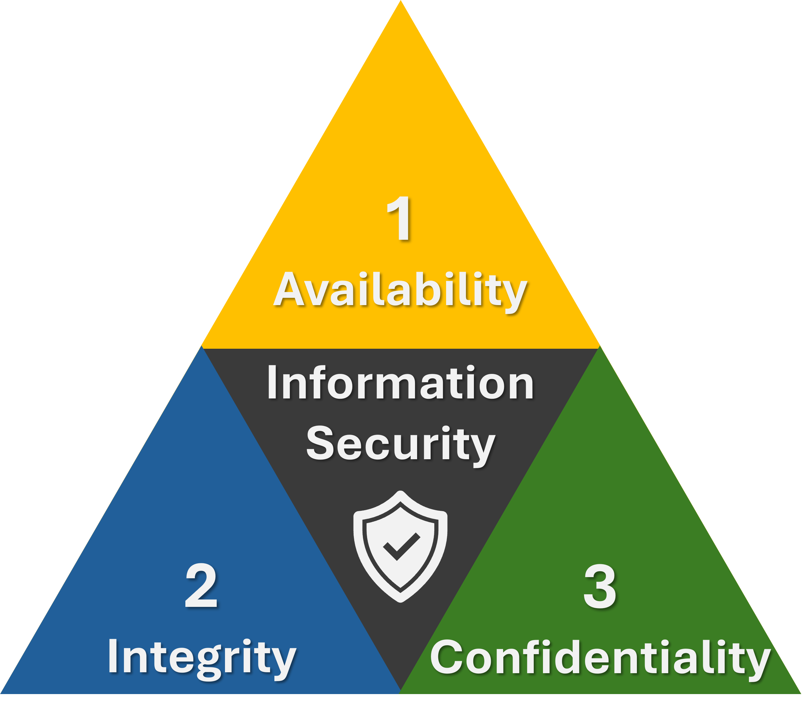

# Course 1: Foundations of Cybersecurity

## About This Course

This is the first course of the Google Cybersecurity Certificate. Through it, I learned that cybersecurity is the practice of ensuring the confidentiality, integrity, and availability of information by protecting networks, devices, people, and data from unauthorized access or criminal exploitation. This course introduced me to the terminology, mindset, and foundational knowledge used across the cybersecurity profession.

---

## Certificate

  

---

## Modules Covered
There are 4 modules in this course:
- Introduction to Cybersecurity
- Evolution of Cybersecurity
- Protect Against Threats, Risks, and Vulnerabilities
- Cybersecurity Tools and Programming Languages

---

## What I Learned

### 1. Core Concepts and Key Terms

Started by building a working vocabulary of the field. These are the terms I now use to reason about risk:

- **Asset** - anything perceived as having value to an organization.
- **Threat** - any circumstance or event that can negatively impact an asset.
- **Compliance** - adhering to internal standards and external regulations; it helps an organization avoid fines and breaches.
- **Security frameworks** - guidelines for building plans that mitigate risk to data and privacy.
- **Security controls** - safeguards designed to reduce specific security risks, used alongside frameworks.
- **Security posture** - an organization's ability to manage its defense of critical assets and react to change.
- **Threat actor** - any person or group who presents a security risk to computers, applications, networks, or data.
- **Internal threat** - a current or former employee, vendor, or trusted partner who poses a risk, whether accidental or intentional.
- **Network security** - keeping an organization's network infrastructure secure from unauthorized access.
- **Cloud security** - ensuring cloud-stored assets are properly configured and accessible only to authorized users.
- **Programming** - writing instructions for a computer to execute tasks such as automating repetitive work, reviewing web traffic, and alerting on suspicious activity.

### 2. Skill for Cybersecurity

**Transferable skills**

- **Communication** - explaining security issues clearly to both technical and non-technical audiences.
- **Problem-solving** - recognizing attack patterns and choosing an efficient, sometimes imperfect, response.
- **Time management** - prioritizing the most urgent issue to minimize damage.
- **Growth mindset** - staying willing to learn as the field and its tools evolve.
- **Diverse perspectives** - valuing different viewpoints to reach better security solutions.

**Technical skills**

- **Programming languages** - automating repetitive analysis and threat searches.
- **SIEM tools** - collecting and analyzing log data to monitor an organization's activity.
- **Intrusion detection systems (IDS)** - monitoring systems and alerting on possible intrusions.
- **Threat landscape knowledge** - staying current on threat actor tactics and emerging malware.
- **Incident response** - following established procedures to investigate and remediate an incident.

### 3. Common Attacks and Why They Work

  

**Phishing** is the use of digital communications to trick people into revealing sensitive data or installing malicious software. The variants I learned to distinguish:

- **Business Email Compromise (BEC)** - impersonates a known source to gain a financial advantage.
- **Spear phishing** - targets a specific user or group, appearing to come from a trusted source.
- **Whaling** - a form of spear phishing aimed at company executives.
- **Vishing** - exploits voice communication to obtain information or impersonate a source.
- **Smishing** - uses text messages for the same purpose.

**Malware** is software designed to harm devices or networks, usually for financial or intelligence gain:

- **Viruses** - malicious code that requires a user to open an infected file before it spreads.
- **Worms** - self-replicate and spread across a network without user action.
- **Ransomware** - encrypts an organization's data and demands payment for its release.
- **Spyware** - gathers and sells personal data without consent.

**Social engineering** exploits human error rather than technical flaws:

- **Social media phishing** - gathers details from a target's social profiles before attacking.
- **Watering hole attack** - compromises a website a specific group frequently visits.
- **USB baiting** - leaves an infected USB drive for someone to plug in.
- **Physical social engineering** - impersonates an employee, customer, or vendor to gain physical access.

These attacks **succeed** as they lean on predictable human responses: 
- **Authority** (respecting a perceived figure of power)
- **Intimidation** (bullying a target into compliance)
- **Consensus** (implying "everyone else already agreed")
- **Scarcity** (implying limited availability)
- **Familiarity** (faking a personal connection)
- **Trust** (building a relationship to exploit later)
- **Urgency** (rushing a decision before it can be questioned)

### 4. CISSP Security Domains and Attack Types

The eight CISSP domains gave an idea organize a security analyst's responsibilities and map each attack type to the area of the business it threatens most:

| Attack Type | What It Targets | Related CISSP Domain |
|---|---|---|
| Password attack | Password-secured devices, systems, or data | Communication and Network Security |
| Social engineering attack | Human trust and judgment | Security and Risk Management |
| Physical attack | Physical environments and hardware | Asset Security |
| Adversarial artificial intelligence | AI/ML systems, used to attack more efficiently | Communication and Network Security; Identity and Access Management |
| Supply-chain attack | Vulnerabilities introduced by third parties | Security and Risk Management; Security Architecture and Engineering; Security Operations |
| Cryptographic attack | Secure communication between sender and recipient | Communication and Network Security |

### 5. Understanding Threat Actors

  

- **Advanced persistent threats (APTs)** - highly skilled actors who research large targets in advance and can remain undetected for a long time, often aiming to damage infrastructure or steal intellectual property.
- **Insider threats** - people who abuse access they are already authorized to have, motivated by sabotage, corruption, espionage, or data leaks.
- **Hacktivists** - driven by a political agenda, using digital tools for demonstrations, propaganda, or social change campaigns.

I also learned that "hacker" is a broad term, and that intent is what separates the categories:

- **Authorized (ethical) hackers** - follow a code of ethics and the law to evaluate organizational risk.
- **Semi-authorized hackers** - researchers who find vulnerabilities but do not exploit them.
- **Unauthorized (unethical) hackers** - malicious actors who break the law for financial gain.
- **New and unskilled threat actors** - motivated by learning, revenge, or exploiting known vulnerabilities with existing tools.
- **Vigilante hackers** - act on their own, outside law enforcement, aiming to counter unethical hackers.

### 6. Controls, Frameworks, and Compliance

  

The **CIA triad** is the model used to reason about risk when systems and policies are designed. It informs the **security controls** put in place, which work alongside **security frameworks** to meet **compliance** requirements. A framework is built around four components: identifying and documenting security goals, setting guidelines to reach them, implementing strong security processes, and monitoring and communicating results. Two related concepts I picked up here are **security architecture** (the tools and processes used to protect against risk) and **security governance** (the practices that support and direct an organization's security efforts).

Also reviewed the major regulations and frameworks a security professional should recognize:

| Framework / Regulation | Focus Area |
|---|---|
| NIST CSF / RMF | Voluntary U.S. frameworks for managing cybersecurity risk |
| FERC-NERC | Protection of the U.S./North American power grid |
| FedRAMP | Standardized security assessment for cloud services (U.S. federal) |
| CIS Controls | Nonprofit-issued controls to safeguard systems and networks |
| GDPR | Protects the data and privacy rights of E.U. residents |
| PCI DSS | Secures credit card storage, processing, and transmission |
| HIPAA | Protects U.S. patients' health information (PHI) |
| ISO | International standards for technology and management |
| SOC 1 / SOC 2 | Reports on an organization's access controls and financial compliance |

### 7. Ethics in Cybersecurity Decisions

I learned that **security ethics** - the guidelines for making appropriate decisions as a professional - it governs how far a defender can go when responding to an attack.

- In the **United States**, counterattacking a threat actor is illegal under laws such as the Computer Fraud and Abuse Act of 1986. Only approved federal or military personnel are permitted to counterattack; everyone else may only defend.
- From an **international** standpoint, the International Court of Justice allows a counterattack only if it affects solely the original attacker, is a direct request to stop, does not escalate the situation, and its effects can be reversed - conditions that are difficult to guarantee in practice.
- Beyond counterattacks, the ethical obligations tied to handling data: **confidentiality** (respecting privacy of assets and data), **privacy protection** (safeguarding **PII** and the more sensitive **SPII** from unauthorized use), and a general duty under the **law** to stay unbiased, transparent, invested in the work, and continually informed - illustrated well by HIPAA's requirement to notify patients after a breach of their health data.

### 8. Tools

I was introduced to the toolkit an entry-level analyst typically relies on:

- **SIEM tools** - collect and analyze log data, then surface alerts so an analyst doesn't have to manually sift through it.
- **Network protocol analyzers (packet sniffers)** - capture and analyze traffic across a network.
- **Playbooks** - manuals for operational actions. Two I focused on: the **chain of custody** playbook (documenting who held evidence and when) and the **protecting and preserving evidence** playbook (handling fragile, volatile data in the correct **order of volatility**, from most to least perishable).
- **Programming** - Python for automation, and **SQL** for creating, interacting with, and querying databases.
- **Operating systems** - Linux (open-source, command-line driven), macOS, and Windows, each with different use cases for an analyst.
- **Web vulnerabilities** - flaws a threat actor can exploit, tracked industry-wide through the OWASP Top 10.
- **Antivirus software** - detects and eliminates malware based on known patterns.
- **Intrusion detection systems (IDS)** - scan network packets and alert on possible intrusions.
- **Encryption** - converts readable plaintext into secure ciphertext so unauthorized users cannot read it.
- **Penetration testing** - a simulated attack used to proactively find vulnerabilities before a real threat actor does.

---

## Skills Gained

- Foundational cybersecurity terminology and concepts
- Applying the CIA triad to risk-based decisions
- Recognizing security frameworks, controls, and compliance obligations
- Identifying attack patterns and mapping attacks to the eight CISSP security domains
- Profiling threat actors and their motivations
- Making ethical and legal decisions as a security professional
- Following incident response playbooks and chain-of-custody proceduresl
- Communication, problem-solving, time management, and a growth mindset

## Key Learnings and Reflections

Completing this course gave me a mental map of the cybersecurity field before I go deeper into any single tool or technique. A few things that stood out were:

- Most successful attacks exploit **people**, not just technology - which is why ethics and communication are treated as core skills, not extras.
- Frameworks, controls, and compliance are three distinct but connected layers, and I now know where each one fits.
- Legally, defense is my only real option as a security professional - counterattacking is off the table in almost every circumstance.
- The tools introduced here (SIEM, IDS, packet analyzers, playbooks) are things I'll actually use hands-on in later courses, so this course was as much about vocabulary as it was about mindset.

## Conclusion

This first course laid the groundwork I needed before moving into the more technical parts of the certificate. I now have a shared vocabulary for threats, attacks, and defenses, an understanding of the legal and ethical boundaries I have to work within, and a first look at the tools I'll be using throughout the rest of the program.
