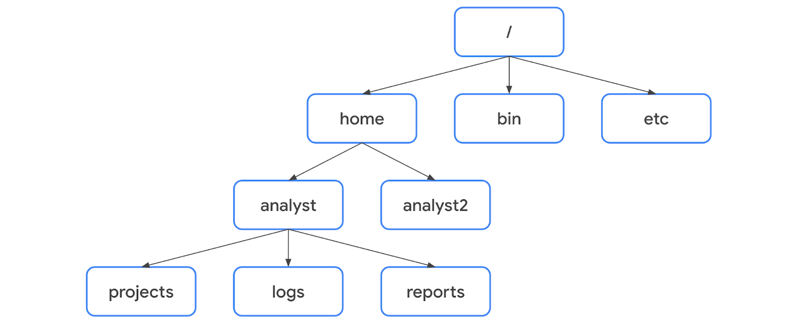

# Course 4. Tools of the Trade: Linux and SQL


## About This Course
This course introduced me to two tools that form the backbone of daily work for a security analyst: Linux and SQL. Before this course, I only had a surface level idea of what an operating system does and had never written a database query. By the end of this course, I could navigate a Linux file system using only the command line, manage users and permissions, filter and search through logs, and write SQL queries to pull specific information out of a database. Below, I explain each concept in my own words, connect ideas where it makes sense, and use examples that reflect how I understood them.

---

## Certificate of completion

<p align="center">
  
</p>

---
## What I Learned

## Part 1: Operating Systems

<p align="center">
  
</p>

### What an operating system actually does

An operating system sits between the user, the applications, and the hardware. I like to think of it as a translator. When I click a button in an app, the OS interprets that request, sends it to the right hardware component, and then brings the result back to the app, displays on screen.

The process has four parts:

| Step | Role |
|---|---|
| User | Starts the request, for example clicking download |
| Application | The program the user interacts with |
| Operating system | Interprets the request and routes it to hardware |
| Hardware | Does the actual processing, then sends the result back |

A simple example is downloading a file. When a user clicks download in the browser, the browser tells the OS, the OS tells the hardware to fetch and store the file, and then the OS reports back to the browser that the download is complete. We never see this exchange happen, similar to how we do not see what happens in a restaurant kitchen when I order food. This is exactly why the course compared the OS to a kitchen. I place an order (make a request), and the kitchen (the OS) handles everything invisibly before returning the finished dish (the output).

### Common operating systems

| OS | Released | Open Source Status | Common Use |
|---|---|---|---|
| Windows | 1985 | Closed source | Personal and enterprise computers |
| macOS | 1984 | Partially open source | Personal and enterprise computers |
| Linux | 1991 | Fully open source | Servers, security work, developers |
| ChromeOS | 2011 | Partially open source | Education |
| Android | 2008 | Open source | Mobile devices |
| iOS | 2007 | Partially open source | Mobile devices |

Understood open source to mean the source code is publicly available so anyone can inspect, modify, or contribute to it. Linux being fully open source is exactly why it is central to security work. Analysts and researchers around the world can review its code, build specialized versions of it, and trust it because nothing is hidden.

### Legacy systems and vulnerabilities

A legacy operating system is one that is outdated but still in use, often because some critical software or embedded hardware only works on that older version. Understood this as a common tradeoff organizations face. They keep old systems running to avoid breaking dependent software, but this comes at a security cost because the vendor may no longer patch vulnerabilities on that old system. This is something I now see as a common example of the balance between operational needs and security risk in the real world.

Keeping systems updated is one of the simplest but most effective ways to reduce risk, because updates usually include security patches for newly discovered vulnerabilities.

## Part 2: Virtualization

<p align="center">
  
</p>

### What a virtual machine is

A virtual machine (VM) is a software based version of a physical computer. Instead of using dedicated physical hardware, it uses software that simulates hardware such as a virtual CPU or virtual RAM. Multiple VMs can run on a single physical machine at the same time, and the physical machine's resources like RAM get divided among them.

I found the benefits split into two categories that made sense to me:

**Security**

VMs act like isolated sandboxes. If I intentionally place malware on a VM to study it, that malware stays contained inside the VM and does not touch the host machine or other VMs, as long as it does not escape the virtual environment. This is a big reason analysts use VMs when investigating suspicious files.

**Efficiency**

Running multiple VMs is like riding a city bus instead of everyone driving separate cars. One physical machine can serve many virtual environments, saving hardware, space, and cost.

A hypervisor is the software that manages VMs and shares the host machine's resources between them. One example I learned is KVM (Kernel based Virtual Machine), which is built directly into the Linux kernel.

## Part 3: The Command Line and Linux Architecture

### CLI vs GUI

A GUI (Graphical User Interface) uses visual elements like icons and windows, and only lets me perform one action at a time. A CLI (Command Line Interface) is entirely text based but allows me to run multiple commands quickly and in sequence. For a security analyst, the CLI has a major advantage: it keeps a history file of every command run. This means I can trace back exactly what actions were taken during an incident response, which is extremely valuable for both accountability and forensics.

<p align="center">
  
</p>

### The layers of Linux architecture

Learned that a request in Linux flows through five layers before reaching the hardware:

1. **User**: the person making the request
2. **Application**: the program the user interacts with
3. **Shell**: the command line interpreter that translates my typed commands into something the kernel understands
4. **Filesystem Hierarchy Standard (FHS)**: organizes where data is stored
5. **Kernel**: manages processes and memory, and communicates directly with hardware

Understanding this layered flow helped me see Linux not as one single black box, but as a set of components that each play a specific role, similar to how the OS itself worked in the earlier restaurant analogy, just broken down into more detail.

### Linux distributions I learned about

| Distribution | Base | Best known for |
|---|---|---|
| Kali Linux | Debian | Pre-installed penetration testing and forensics tools |
| Ubuntu | Debian | User friendly, large community, common in cloud computing |
| Parrot | Debian | Security focused, user friendly GUI |
| Red Hat Enterprise Linux | Independent | Subscription based, enterprise support |
| AlmaLinux | Red Hat / CentOS | Free, stable replacement for CentOS |

Knowing which distribution is derived from which parent matters practically, because it tells me which package manager to use. Debian based systems use APT, while Red Hat based systems use YUM.

### Package managers

A package is a piece of software, and a package manager helps install, update, and remove these packages along with their dependencies.

| Tool | Distribution family | File extension |
|---|---|---|
| APT (Advanced Package Tool) | Debian based | .deb |
| YUM (Yellowdog Updater Modified) | Red Hat based | .rpm |

Example command I practiced using the `suricata` app using `sudo` privilege:

```bash
sudo apt install suricata
sudo apt remove suricata
apt list --installed
```

Discovered that `sudo` is required before install or remove commands because changing installed software needs elevated privileges. This connects directly to the principle of least privilege that I explore later in permissions.

## Part 4: Navigating the Linux File System

### The Filesystem Hierarchy Standard (FHS)

<p align="center">
  
</p>

Everything in Linux branches from the root directory, represented by a forward slash `/`. Below root are standard directories:

| Directory | Purpose |
|---|---|
| /home | Personal directories for each user |
| /bin | Binary and executable files |
| /etc | System configuration files |
| /tmp | Temporary files, often targeted by attackers since anyone can modify them |
| /mnt | Mounted media like USB drives |

Realized difference between an absolute path, which always starts from root, and a relative path, which starts from the current directory. For example, `/home/analyst/logs` is absolute, while `../logs` is relative. The tilde `~` is a shortcut for the current user's home directory.

### Core navigation commands

```bash
pwd                      # print working directory
ls                       # list files and directories
cd <directory_name>      # change directory to a subdirectory
cd ..                    # move up one level
whoami                   # show current username
```

### Reading file content

```bash
cat <filename>          # show full file content
head <filename>         # show first 10 lines
head -n 5 <filename>    # show first 5 lines
tail <filename>         # show last 10 lines
less <filename>         # view file one page at a time
```

I found `tail` particularly practical for security work, since checking the end of a log file is usually how I would look at the most recent activity.

### Filtering content

The `grep` command searches a file for a specific string and returns matching lines.

```bash
grep 'keyword' <filename>
```

Piping, using the `|` character, lets me send the output of one command into another command as input.

```bash
ls /home/user/directory | grep 'keyword'
```

The `find` command searches for files or directories based on criteria such as name pattern or modification time.

```bash
find /home/user/directory -name "*log*"   #searching for directory name containing string, name is case sensitive
find /home/user/directory -iname "*log*"  #searching for directory name containing string, iname is not case-sensitive
find /home/user/directory -mtime -3       #searching with modified time
```

The asterisk `*` is a wildcard representing zero or more unknown characters. `-name` is case sensitive while `-iname` is not. `-mtime -3` means modified within the last three days, while `-mtime +1` means modified more than one day ago.

I connected this to real investigative work. If I suspected a breach, I could use `find` to locate recently modified files, then use `grep` to search their contents for suspicious keywords, all without leaving the shell.

### Managing directories and files

```bash
mkdir logs           # create a directory logs
rmdir temp            # remove an empty directory temp
touch file.txt        # create an empty file named as file.txt
rm file.txt            # delete a file named as file.txt
mv file.txt /path/     # move (or rename) file.txt to given path
cp file.txt /path/     # copy file.txt to given path
```

The `nano` text editor lets me create or edit files directly in the terminal. I use `Ctrl + O` to save and `Ctrl + X` to exit.

I also learned output redirection, which is a different way of writing to files compared to piping:

| Operator | Behavior |
|---|---|
| `>` | Overwrites the file with new content |
| `>>` | Appends new content to the end of the file |

```bash
echo "last updated date" >> file.txt
```

I understood `>` as risky because it destroys whatever was in the file before, while `>>` is safer since it only adds to the file.

## Part 5: Permissions, Authentication, and Authorization

### Reading the permission string

Every file and directory in Linux has a 10 character permission string, for example `drwxrwxr-x`. I broke this down as follows:

| Position | Meaning |
|---|---|
| 1st character | File type, `d` for directory, `-` for a regular file |
| 2nd to 4th | Read, write, execute for the user (owner) |
| 5th to 7th | Read, write, execute for the group |
| 8th to 10th | Read, write, execute for other (everyone else) |

For a file, read means viewing content, write means modifying content, and execute means running it as a program. For a directory, read means listing its contents, write means creating files inside it, and execute means being able to enter it.

```bash
ls -l      # show permissions
ls -la     # show permissions including hidden files
```

### Changing permissions with chmod

```bash
chmod u+rwx,g+rwx,o+rwx file1.txt   # add all permissions
chmod g-rw file2.txt                # remove group read and write
chmod o-w  file3.txt                # remove write from others
```

| Symbol | Meaning |
|---|---|
| u | user |
| g | group |
| o | other |
| + | add permission |
| - | remove permission |
| = | set permission exactly |

### The principle of least privilege

This is a concept I found genuinely important beyond just this course. It means giving users only the access they need to do their job, nothing more. I practiced this directly in a lab where a file called `bonuses.txt` had read and write access open to an entire HR group, when only one specific user actually needed access. The fix was simple:

```bash
chmod g-rw bonuses.txt
```

This small command reflects a much bigger security idea: every unnecessary permission is a potential attack surface. If an account with too much access gets compromised, the damage an attacker can do is far greater.

### Authentication and authorization with sudo

I learned to separate two concepts that are easy to confuse:

- **Authentication** is proving who you are (logging in)
- **Authorization** is what you are allowed to access once you are in

`sudo` temporarily grants elevated privileges to a trusted user without requiring them to log in as the actual root (super user) account. This matters because logging in directly as root is risky. If that account is compromised, the attacker has unrestricted access, and there is no record of which individual user ran which command.

```bash
sudo useradd user-umx                     # add a new user
sudo useradd -g security user-umx         # set primary group
sudo useradd -G finance,admin user-umx    # add supplemental groups
sudo usermod -a -G marketing user-umx     # add to a group without removing existing ones
sudo usermod -L user-umx                  # lock an account
sudo userdel -r user-umx                  # delete a user and their home directory
sudo chown user-umx access-file.txt            # change file owner
sudo chown :security access-file.txt          # change group owner
```

I paid close attention to the `-a` flag with `usermod -G`. Without it, the command replaces all of a user's existing supplemental groups instead of adding a new one. This is a small detail, but forgetting it could accidentally strip a user of access they still need.

### Getting help in Linux

```bash
man chown              # detailed manual page for a command (chown in this case)
apropos graph editor   # search descriptions for a keyword (search for graph editor)
whatis nano            # one line description of a command (summary for nano)
```

Beyond built in tools, the Unix and Linux Stack Exchange is a trusted community resource I can use to troubleshoot issues that are not covered by the manual pages.

## Part 6: SQL

### Why SQL versus Linux filtering

Before writing any SQL, I compared it against Linux based filtering, since both let me search through data.

| Aspect | Linux | SQL |
|---|---|---|
| Purpose | Filters files, directories, processes | Filters structured data inside databases |
| Structure | Free form text output | Organized rows and columns |
| Joining data | Not possible directly | Can join multiple tables together |
| Best used when | Data is in plain text logs | Data is stored in a structured database |

This comparison helped me understand that these two tools are not competitors, they are complementary. A security analyst needs both depending on where the data lives.

### Basic query structure

Suppose we have a `employees`, `customers` table from a database with various columns of data.

Every query needs at least `SELECT` and `FROM`.

```sql
SELECT firstname, lastname
FROM employees;
```

`SELECT` defines which columns to return, and `FROM` defines which table to pull them from. Using `SELECT *` returns every column, but I learned this should be avoided on large tables since it can slow down performance and return more data than needed.

### Sorting results with ORDER BY

```sql
SELECT customerid, city, country
FROM customers
ORDER BY city DESC;
```

By default, `ORDER BY` sorts in ascending order, meaning smallest to largest for numbers or A to Z for text. Adding `DESC` reverses this. I can also sort by multiple columns, where SQL sorts by the first column and then uses the second column as a tiebreaker.

### Filtering with WHERE

```sql
SELECT firstname, lastname, title, email
FROM employees
WHERE title = 'IT Staff';
```

`WHERE` narrows results down to rows matching a specific condition, similar in spirit to `grep` in Linux, except SQL works on structured columns instead of raw text lines.

### Pattern matching with LIKE and wildcards

| Wildcard | Meaning |
|---|---|
| % | Matches zero or more characters |
| _ | Matches exactly one character |

```sql
SELECT lastname, firstname, title, email
FROM employees
WHERE title LIKE 'IT%';
```

This example returns any title starting with "IT", including "IT Staff" and "IT Manager". I connected this directly to a real use case: quickly finding every login attempt where a username or IP address follows a suspicious partial pattern.

### Operators for numbers and dates

| Operator | Meaning |
|---|---|
| < | less than |
| > | greater than |
| = | equal to |
| <= | less than or equal to |
| >= | greater than or equal to |
| <> or != | not equal to |

```sql
SELECT firstname, lastname, hiredate
FROM employees
WHERE hiredate BETWEEN '2002-01-01' AND '2003-01-01';
```

`BETWEEN` is inclusive, meaning both the start date and end date are included in the results. I understood the difference between exclusive and inclusive operators here: `>` excludes the exact value being compared, while `>=` includes it.

### Logical operators, AND, OR, NOT

```sql
-- AND: both conditions must be true
SELECT firstname, lastname, email, country, supportrepid
FROM customers
WHERE supportrepid = 5 AND country = 'USA';

-- OR: either condition can be true
SELECT firstname, lastname, email, country
FROM customers
WHERE country = 'Canada' OR country = 'USA';

-- NOT: excludes matching rows
SELECT firstname, lastname, email, country
FROM customers
WHERE NOT country = 'USA';
```

I found `AND` useful when every condition satisfied at once, like narrowing down to a very specific group of affected accounts, while `OR` is useful when I want to cover multiple acceptable values, like flagging customers across two countries at the same time.

### Joining tables

Joins let me combine data across two or more tables that share a common column. This is something Linux simply cannot do, and it is one of the biggest reasons SQL is essential when working with relational databases.

| Join type | Returns |
|---|---|
| INNER JOIN | Only rows that match in both tables |
| LEFT JOIN | All rows from the first (left) table, matched rows from the second |
| RIGHT JOIN | All rows from the second (right) table, matched rows from the first |
| FULL OUTER JOIN | All rows from both tables |

```sql
SELECT *
FROM employees
INNER JOIN machines ON employees.device_id = machines.device_id;
```

I noted an important detail: when a column name exists in both tables, like `device_id`, I have to specify the table name before the column, written as `employees.device_id`. If the column name is unique to one table, I can just use the column name alone.

Also learned that a `LEFT JOIN` can be flipped into an equivalent `RIGHT JOIN` simply by reversing the order of the tables in the query. This helped me realize left and right joins are really the same concept, just expressed from opposite directions.

### Aggregate functions

Aggregate functions calculate a single result from many rows, instead of returning the raw data itself.

| Function | Purpose |
|---|---|
| COUNT | Number of rows returned |
| AVG | Average of numeric values in a column |
| SUM | Total of numeric values in a column |

```sql
SELECT COUNT(firstname)
FROM customers
WHERE country = 'USA';
```

This query does not return customer names, it returns a single number representing how many customers are from the USA. I saw this as a fast way to get a quick statistic from a table without manually counting rows myself.

## Part 7: Hands on Labs I Completed

Throughout the course, I applied everything above in guided lab environments using a Linux Bash shell. These labs gave me practical, repeatable experience rather than just theory.

| Lab | What I practiced |
|---|---|
| Examine input and output | Using `echo` and `expr` to generate output and perform calculations |
| Find files with Linux commands | Navigating directories and reading file content with `pwd`, `ls`, `cd`, `cat`, `head` |
| Install software | Installing, verifying, and removing packages with APT and sudo |
| Filter with grep | Using `grep` and piping to search log and user files |
| Manage files | Creating, moving, deleting files and directories, editing with nano |
| Manage authorization | Reading and modifying permission strings with `chmod` |
| Add and manage users | Creating, modifying, and deleting users and groups with sudo |

Each lab simulated a small real world scenario, such as investigating a server log, correcting overly broad file permissions, or onboarding and offboarding an employee account. Working through these made the commands stick far better than reading about them alone.

## Skills Gained

- Navigating a Linux file system using absolute and relative paths
- Reading, creating, editing, moving, and deleting files and directories from the command line
- Searching and filtering text using `grep`, piping, and `find`
- Reading and interpreting Linux permission strings
- Applying the principle of least privilege using `chmod`
- Managing user accounts and groups using `sudo`, `useradd`, `usermod`, `userdel`, and `chown`
- Installing and removing software using APT and understanding package managers
- Writing SQL queries using `SELECT`, `FROM`, `WHERE`, `ORDER BY`
- Filtering data with wildcards, `LIKE`, comparison operators, and `BETWEEN`
- Combining conditions with `AND`, `OR`, and `NOT`
- Joining multiple tables using `INNER JOIN`, `LEFT JOIN`, `RIGHT JOIN`, and `FULL OUTER JOIN`
- Summarizing data using aggregate functions like `COUNT`, `AVG`, and `SUM`
- Understanding virtualization and how virtual machines support secure, isolated testing

## Key Learnings and Reflections

- Operating systems act as a translator between users, applications, and hardware
- Legacy systems are a common but risky tradeoff organizations make for compatibility reasons
- Virtual machines provide isolated, efficient environments useful for security testing
- Linux is fully open source, which makes it central to the security industry
- The CLI records a history file that supports accountability and forensic review
- Linux organizes data through the Filesystem Hierarchy Standard, starting at the root directory
- Different Linux distributions use different package managers, mainly APT for Debian based systems and YUM for Red Hat based systems
- Permissions in Linux follow a 10 character string covering user, group, and other access
- The principle of least privilege should guide every permission and access decision
- `sudo` provides safer elevated access compared to logging in as root
- SQL organizes data into rows and columns, making it far more structured than plain text filtering in Linux
- `WHERE`, `LIKE`, and wildcards allow precise, pattern based filtering of data

---

## Conclusion

This course gave me a working foundation in two tools I will use constantly as a security analyst. Linux taught me how to move through a system without a graphical interface, read and filter data quickly, and manage who has access to what. SQL taught me how to pull precise answers out of structured data instead of manually scanning through it. What stood out most to me is how these two tools complement each other. Linux is my tool when data lives in files and logs on a system, and SQL is my tool when that same data lives inside an organized database. Together, they cover most of the situations a security analyst will run into when investigating or maintaining a system.
- Joins let SQL combine related data across multiple tables, something Linux cannot do directly
- Aggregate functions return summarized statistics instead of raw data rows
- Linux and SQL are complementary tools, each suited to different types of data storage
