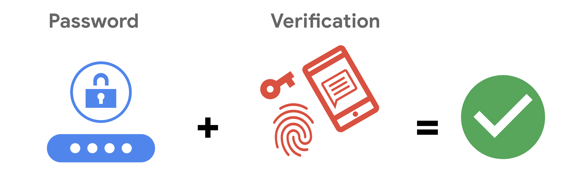
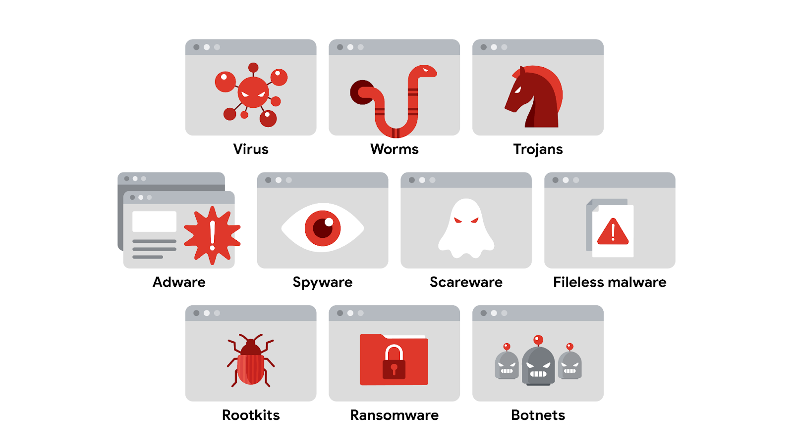

# Course 5: Assets, Threats, and Vulnerabilities


## About This Course
This course builds the foundation of how security professionals think about protecting an organization. It moves from basic definitions of risk, to asset classification, cloud security, cryptography, identity management, attacker behavior, and common attack techniques like malware, phishing, and SQL injection. Below is a breakdown of every topic covered, explained in simple terms with examples, along with the hands on labs I completed during the course.

---

## Certificate

<p align="center">
  
</p>

---
# What I Learned

## Understanding Risk, Threats, and Vulnerabilities

Security starts with three core terms that people often use interchangeably in daily life, but which mean very specific things in this field.

| Term | Meaning |
|---|---|
| Risk | Anything that can affect the confidentiality, integrity, or availability of an asset |
| Threat | Any circumstance or event that can negatively impact an asset |
| Vulnerability | A weakness that a threat can exploit |

Risk is often expressed with a simple formula:

**Likelihood x Impact = Risk**

A good way to picture this is commuting to work by car. Driving on a road full of nails increases the likelihood of a flat tire, and losing a job because of being late is the impact. In business terms, a threat is the nail, and the vulnerability is a tire that is not built to resist punctures. Reducing risk usually means dealing with the likelihood side, since the impact of a negative event depends on the asset itself.

Threats fall into two categories, intentional (a hacker exploiting a misconfigured system) and unintentional (an employee holding the door open for a stranger). Vulnerabilities fall into two categories as well, technical (misconfigured software) and human (a lost access card). Calculating risk this way helps an organization prevent costly events, prioritize critical assets, and decide which risks it can tolerate.

---

## Asset Classification and Management

Asset management is the practice of tracking assets and the risks connected to them. The core idea is simple, an organization can only protect what it knows it has. Assets are not limited to hardware. They include digital assets like customer data, information systems like networks, physical assets like buildings, and intangible assets like brand reputation.

To classify an asset properly, an organization needs to know four things, what it is, where it is, who owns it, and how important it is. The most common classification scheme used across the industry has four levels.

| Classification | Description |
|---|---|
| Restricted | The highest level, reserved for need to know information |
| Confidential | Disclosure would cause significant negative impact |
| Internal only | Available to employees and business partners |
| Public | No negative consequence if released |

One challenge I found interesting is that ownership is not always obvious. A company laptop is owned by the business, but if an employee stores personal photos on it, the classification becomes mixed. A single piece of information, like a home address on a letter, can also carry more than one classification level at the same time, since a name may be public while an address is confidential.

---

## Cloud Computing and Cloud Security

Cloud computing changed how businesses operate online by removing the need to build and maintain physical infrastructure. There are three main categories of cloud based services.

| Service Model | What it provides | Example |
|---|---|---|
| SaaS (Software as a Service) | Ready to use applications accessed through a browser | Gmail, Slack, Zoom |
| PaaS (Platform as a Service) | Development tools to build and deploy apps | Google App Engine, Heroku |
| IaaS (Infrastructure as a Service) | Raw computing resources like servers and storage | Google Cloud Platform, Microsoft Azure |

As responsibility shifts to the cloud, security responsibility also shifts. This concept is called the **shared responsibility model**. The cloud provider secures the underlying infrastructure, while the client is responsible for things directly in their control, such as identity and access management, resource configuration, and data handling. The exact split depends on whether the service is SaaS, PaaS, or IaaS.

Common cloud security challenges include misconfiguration (using default settings that do not match a company's needs), cloud native breaches, difficulty monitoring access, and meeting regulatory standards like HIPAA, PCI DSS, and GDPR. Since cloud adoption keeps growing, cloud security has become one of the most in demand skills in the field.

---

## NIST Cybersecurity Framework

The NIST Cybersecurity Framework (CSF) was released in 2014 to protect critical infrastructure in the United States, and was later adapted for businesses of any size. It is voluntary, unlike a regulation which must be followed by law. The framework has three components.

<p align="center">
  
</p>

| Component | Purpose |
|---|---|
| Core | Six functions: Identify, Protect, Detect, Respond, Recover, Govern |
| Tiers | A scale from 1 to 4 that measures how sophisticated a security program is |
| Profiles | Pre made templates tailored to a specific organization or industry |

The Govern function was added in 2024 to highlight the role of leadership in managing cybersecurity risk. CISA recommends a four step approach to implement the CSF, create a current profile of security operations, perform a risk assessment, prioritize existing gaps, and implement a plan of action. I see the CSF as a flexible checklist rather than a rigid rulebook, which is what makes it usable by both small businesses and large enterprises.

---

## Principle of Least Privilege and Separation of Duties

The **principle of least privilege (PoLP)** means a user is only given the minimum access needed to do their job. This directly supports the CIA triad (confidentiality, integrity, availability) because it limits how much damage a compromised account can cause. A closely related concept is **separation of duties**, which divides responsibilities among different people so no single person has too much control. For example, the person who approves a purchase should not be the same person who enters that purchase into the system.

To apply least privilege, two questions must be answered, who is the user, and how much access do they actually need. Common account types include:

* Guest accounts for external users like clients or contractors
* User accounts assigned based on job duties
* Service accounts used by applications
* Privileged accounts with elevated administrative access

Access is not something to set once and forget. Organizations run three kinds of audits to keep it in check.

| Audit Type | Purpose |
|---|---|
| Usage audit | Reviews what a user is actually doing with their access |
| Privilege audit | Checks whether a user's role still matches their access level, this catches privilege creep |
| Account change audit | Tracks changes made to an account to spot suspicious activity |

---

## The Data Lifecycle and Data Governance

<p align="center">
  
</p>

Data does not stay in one state. It moves through five stages known as the **data lifecycle**: Collect, Store, Use, Archive, and Destroy. Each stage requires its own security controls to keep information protected.

Managing this properly requires **data governance**, a set of policies that define how data is handled across an organization. Three roles are commonly assigned:

| Role | Responsibility |
|---|---|
| Data owner | Decides who can access, edit, or destroy the information |
| Data custodian | Handles the safe storage and transport of the information |
| Data steward | Maintains and enforces the governance policies |

As someone training for a security analyst role, I now understand that my primary responsibility in this model would be acting as a data custodian, keeping data safe without necessarily owning it.

---

## Protecting Legally Sensitive Information

Not all personal data carries the same weight under the law. Three categories require special protection.

| Term | Meaning |
|---|---|
| PII | Personally identifiable information, anything that can identify or locate a person |
| PHI | Protected health information, regulated by HIPAA in the US and GDPR in the EU |
| SPII | Sensitive PII, information that should only be accessed on a strict need to know basis, like a bank account number |

The reason these categories exist is that data represents real decisions people make about their health, money, and privacy, so the data owner should always have control over how it is shared.

---

## Privacy Regulations, Compliance, Audits and Assessments

Security and privacy are related but different. **Information privacy** is about giving people control over their personal data. **Information security (InfoSec)** is about keeping that data safe from unauthorized users. A company might collect data for marketing purposes, but it still needs consent from the customer and a way for them to opt out, that is privacy. Once collected, the company protects that data with technical controls, that is security.

Three regulations come up repeatedly in this field.

| Regulation | Focus |
|---|---|
| GDPR | Gives EU citizens control over their personal data, applies to any company handling that data regardless of location |
| PCI DSS | Secures credit and debit card transactions |
| HIPAA | Protects patient health information in the United States |

To stay compliant, organizations rely on two recurring processes.

* **Security audit**: a review of controls and policies against a set of expectations, usually performed once a year, often by external parties
* **Security assessment**: a check on how resilient the current security setup is against threats, usually performed every three to six months by internal teams as preparation for the audit

---

## Cryptography: Symmetric and Asymmetric Encryption

Encryption converts data from a readable format into an encoded one, so it stays private even if intercepted. There are two main types.

| Type | How it works | Key characteristic |
|---|---|---|
| Symmetric encryption | One secret key encrypts and decrypts data | Fast, but both sides must share the same key |
| Asymmetric encryption | A public key encrypts, a private key decrypts | Slower, but more secure for exchanging the initial connection |

Longer key lengths resist brute force attacks better, but they also slow down processing, so real systems balance both types together. A website typically uses asymmetric encryption to secure the login process, then switches to symmetric encryption for the rest of the session because it is faster.

| Algorithm | Type | Key Length |
|---|---|---|
| Triple DES (3DES) | Symmetric | Effective 168 bit |
| AES | Symmetric | 128, 192, or 256 bit |
| RSA | Asymmetric | 1024, 2048, or 4096 bit |
| DSA | Asymmetric | 2048 bit |

An important idea I learned here is **Kerckhoff's principle**. A cryptographic system should remain secure even if every detail about how it works is public, except for the private key itself. In other words, a system that only works because its method is secret is not actually secure. This is why AES is publicly documented and still considered unbreakable, while custom made secret encryption schemes tend to get cracked quickly once exposed.

Tools like **OpenSSL**, an open source command line tool, are commonly used to generate these keys. OpenSSL itself was affected by the Heartbleed bug in 2014, which is a reminder that even foundational security tools need to be kept updated.


---

## Hands on Lab: Decrypting Files with Linux and OpenSSL

In this lab, I practiced recovering encrypted files using the Linux command line. The scenario simulated a situation where all files in a home directory had been encrypted, and I had to solve a Caesar cipher to reveal the password needed to decrypt the actual data file.

Key commands I used:

```bash
ls -a                                     # list all files, including hidden ones
cat .leftShift3 | tr "d-za-cD-ZA-C" "a-zA-Z"   # decode a Caesar cipher shifted by 3
openssl aes-256-cbc -pbkdf2 -a -d -in Q1.encrypted -out Q1.recovered -k ettubrute
```

This exercise showed me how a Caesar cipher works by shifting each letter a fixed number of places in the alphabet, and how the `tr` command can reverse that shift by mapping one character set back to another. It also gave me hands on practice with OpenSSL, where `-d` means decrypt, `-in` and `-out` define the input and output files, and `-k` supplies the password.

---

## Hash Functions and Secure Password Storage

A **hash function** takes data of any size and converts it into a fixed size value called a digest, and this process cannot be reversed. Hashing is mainly used to verify integrity and to store passwords safely, since the original password is never stored anywhere.

MD5, developed in the early 1990s, was one of the earliest hash functions, producing a 128 bit value. It was later found to be vulnerable to **hash collisions**, meaning two different inputs could produce the same output, which defeats the purpose of using a hash for authentication. This led to the SHA family of algorithms.

| Algorithm | Digest Size |
|---|---|
| SHA-1 | 160 bit |
| SHA-224 | 224 bit |
| SHA-256 | 256 bit |
| SHA-384 | 384 bit |
| SHA-512 | 512 bit |

Attackers who steal a password database can try to crack hashes using a **rainbow table**, which is a precomputed list of hash values matched to plaintext passwords. The defense against this is **salting**, adding a random string of characters to a password before hashing it. Salting means that even if two users pick the same password, their stored hash values will look completely different, which makes rainbow tables useless against them.

---

## Hands on Lab: Comparing File Hashes

This lab reinforced why hashing matters for detecting file tampering. Two text files looked identical when I viewed them with `cat`, but generating their hashes told a different story.

```bash
sha256sum file1.txt
sha256sum file2.txt
```

The two files produced completely different SHA-256 values, proving that their contents were not actually identical even though they looked the same on screen. This is exactly how a security team would catch a malicious file disguised as a legitimate one, since even a single changed character produces a completely different hash.

---

## Authentication: SSO and MFA

Authentication is normally verified through three factors, something a user knows (a password), something a user has (a phone or token), and something a user is (a fingerprint).

**Single sign on (SSO)** lets a user log in once and gain access to multiple connected services, reducing password fatigue and the number of access points an attacker can target. It works by using a trusted third party identity provider, and typically relies on protocols like LDAP (used on premises) and SAML (used off premises, such as in the cloud).

<p align="center">
  
</p>

SSO alone still relies on a single set of credentials, so if that password is stolen, every connected service is exposed. This is where **multi factor authentication (MFA)** comes in. MFA requires two or more of the three factors above before granting access, similar to needing both a debit card and a PIN at an ATM. Together, SSO improves convenience while MFA adds a second layer of proof, and most modern systems combine both.

<p align="center">
  
</p>

---

## Identity and Access Management

**Identity and access management (IAM)** is the collection of processes and technologies that manage digital identities and their access. It works alongside the **AAA framework** (authentication, authorization, accounting) to make sure the right user gets the right resource at the right time and for the right reason.

Once a user is authenticated, the system still needs to decide what they are authorized to do. Three common models handle this.

| Model | How access is granted |
|---|---|
| MAC (Mandatory Access Control) | Access is granted manually by a central authority, strictest model, common in government and military |
| DAC (Discretionary Access Control) | The data owner decides who gets access, like sharing a Google Drive folder |
| RBAC (Role Based Access Control) | Access is based on a user's role in the organization |

I also learned about **user provisioning**, the process of creating a digital identity when someone joins an organization, and **deprovisioning**, removing that access when it is no longer needed, which is just as important for reducing risk.

<p align="center">
  
</p>

---

## Securing CI/CD Pipelines

**CI/CD** stands for Continuous Integration, Continuous Delivery, and Continuous Deployment. It automates how software moves from code being written to code being released.

<p align="center">
  
</p>

| Stage | What it does |
|---|---|
| Continuous Integration | Frequently merges code from different developers, automatically builds and tests it |
| Continuous Delivery | Code is automatically prepared for release, but a manual approval step remains before going live |
| Continuous Deployment | Fully automated, code that passes checks goes live with no manual approval |

Automation is powerful, but an insecure pipeline can introduce vulnerabilities at scale. Common risks include insecure third party dependencies, weak access permissions on pipeline tools, missing automated security testing, hardcoded secrets like API keys, and unsecured build environments. The fix for these follows a **DevSecOps** approach, where security is built into every stage rather than checked at the end, combined with practices like least privilege access, automated scanning tools such as SAST and DAST, and dedicated secrets management tools instead of hardcoding credentials.

---

## The OWASP Top 10

**OWASP**, the Open Worldwide Application Security Project, publishes a list called the OWASP Top 10, updated every few years, that ranks the most common vulnerabilities found in web applications.

| Vulnerability | What it means |
|---|---|
| Broken access control | Users can perform actions they should not be authorized to do |
| Cryptographic failures | Sensitive data is not properly encrypted |
| Injection | Malicious code is inserted into an application through an input field |
| Insecure design | Missing security controls from the start of development |
| Security misconfiguration | Settings are left at insecure defaults |
| Vulnerable and outdated components | Using unmaintained open source libraries |
| Identification and authentication failures | The system fails to properly verify who a user is |
| Software and data integrity failures | Updates are not properly reviewed, can lead to a supply chain attack |
| Security logging and monitoring failures | Events are not tracked, making it hard to detect and respond to attacks |
| Server side request forgery (SSRF) | An attacker manipulates a server into fetching unauthorized data |

A real example that ties this together is the 2020 SolarWinds attack, where malicious code was injected into a legitimate software update, affecting thousands of downstream customers, which is a textbook case of a software and data integrity failure.

---

## Open Source Intelligence

**OSINT** is the collection and analysis of information from publicly available sources to generate usable intelligence. It is important to separate two related ideas, information is raw data, while intelligence is the insight produced after analyzing that data. For example, learning about a new OS update is information, but discovering that the update is linked to a new vulnerability through research is intelligence.

Common OSINT tools include:

* **VirusTotal**, for analyzing suspicious files, domains, and URLs
* **MITRE ATT&CK**, a knowledge base of real world adversary tactics
* **OSINT Framework**, a directory of tools organized by source type
* **Have I Been Pwned**, for checking if an email has been part of a data breach

---

## Vulnerability Scanning

A **vulnerability scanner** is software that automatically checks systems against known vulnerabilities. Unlike an attacker, scanners are meant to be non intrusive, they simply flag issues rather than exploit them. Scans can be categorized in three ways.

| Comparison | Meaning |
|---|---|
| External vs Internal | External tests the outward facing perimeter, internal examines systems from within the network |
| Authenticated vs Unauthenticated | Authenticated logs in as a real user to find deeper issues, unauthenticated simulates an outsider with no access |
| Limited vs Comprehensive | Limited checks a specific device, comprehensive checks everything connected to the network |

Scans usually target five attack surfaces, the perimeter, network, endpoint, application, and data layers, giving a full picture of where an organization is exposed.

---

## Patch Management and Software Updates

A **patch** is a software update that fixes a known security vulnerability. Patches can be delivered manually, where IT staff or users control the timing, or automatically, where the system handles it on its own.

| Strategy | Advantage | Disadvantage |
|---|---|---|
| Manual updates | More control, useful if updates are unstable | Critical patches can be forgotten |
| Automatic updates | Keeps systems current without effort | Can cause instability if not tested well |

**End of life (EOL) software** is software that no longer receives updates because the vendor has moved on to newer versions. CISA recommends discontinuing EOL software entirely, since it represents an unfixable risk, even though replacing it can be costly. This becomes a bigger concern as more IoT devices, like smart light bulbs, connect to networks without receiving regular updates.

---

## Penetration Testing

A **penetration test (pen test)** is an authorized, simulated attack used to find and exploit weaknesses before a real attacker does. This differs from a vulnerability assessment, which only identifies weaknesses without exploiting them. Pen testing is considered a form of ethical hacking because it is authorized.

| Approach | Role |
|---|---|
| Red team | Simulates the attacker, tries to break in |
| Blue team | Defends the system, responds to the simulated attack |
| Purple team | Combines both, focused on collaborative improvement |

Testers also choose how much internal knowledge they start with.

| Strategy | Also known as | Access level |
|---|---|---|
| Open box | White box, full knowledge | Same access as an internal developer |
| Closed box | Black box, zero knowledge | Little to no internal access, closest to a real attack |
| Partial knowledge | Gray box | Limited access, similar to a regular employee |

Organizations regulated by PCI DSS, HIPAA, or GDPR are often required to perform pen testing regularly to stay compliant. Some companies also run **bug bounty programs**, paying independent ethical hackers to find and report vulnerabilities.

---

## Thinking Like an Attacker

Applying an attacker mindset means proactively looking for weaknesses the way a real threat actor would, rather than only reacting after something goes wrong. This is usually done through two kinds of simulations, matching the red and blue team roles mentioned earlier.

* **Proactive simulations** exploit vulnerabilities directly, like sending fake phishing emails to test staff awareness
* **Reactive simulations** focus on gathering information through scanning tools and following a structured process, identification, vulnerability analysis, risk assessment, and remediation

I found this section useful because it reframes vulnerability management as an ongoing exercise rather than a one time fix, staying current on resources like NIST's National Vulnerability Database is part of that habit.

---

## Types of Threat Actors and Attack Vectors

A **threat actor** is any person or group that presents a security risk, whether the intent is malicious or accidental.

| Threat Actor | Motivation |
|---|---|
| Competitors | Benefit from leaked business information |
| State actors | Government intelligence agencies |
| Criminal syndicates | Organized groups seeking financial gain |
| Insider threats | Anyone with authorized access who misuses or accidentally compromises it |
| Shadow IT | Employees using unapproved technology, like personal email for work |

Hackers themselves fall into three categories based on intent, unauthorized (malicious) hackers, authorized or ethical hackers who improve security, and semi authorized hackers like hacktivists who break rules for a cause rather than personal gain. When a threat actor maintains unauthorized access for a long time to quietly gather intelligence, this is called an **advanced persistent threat (APT)**, most often linked to nation states.

Threat actors gain access through common vectors, direct physical access, removable media like USB drives, social media, email, wireless networks, cloud services, and supply chains through third party vendors.

---

## Brute Force Attacks and Defenses

A **brute force attack** is a trial and error method used to guess login credentials or encrypted information.

| Attack Type | Method |
|---|---|
| Simple brute force | Tries every possible combination of credentials |
| Dictionary attack | Tries a prebuilt list of common credentials |
| Reverse brute force | Starts with one known credential and tries it across many systems |
| Credential stuffing | Reuses stolen credentials from a previous breach on a different service |

Tools like Hashcat, John the Ripper, and Aircrack-ng automate this process, since manually testing every combination would take far too long. Organizations defend against these attacks with a layered approach.

* Hashing and salting, making stolen data far harder to crack
* MFA, requiring more than one credential to succeed
* CAPTCHA, proving the login attempt is coming from a human, not a script
* Password policies, enforcing minimum length, complexity, and lockout after repeated failed attempts

<p align="center">
  
</p>

---

## Social Engineering Tactics

**Social engineering** is a manipulation technique that exploits human psychology rather than technical flaws, since it is often easier to trick a person than to break through a firewall.

| Tactic | Description |
|---|---|
| Baiting | Tempts a victim with something appealing, like a USB drive left in a parking lot |
| Phishing | Uses digital communication, usually email, to trick someone into revealing data |
| Quid pro quo | Promises a reward in exchange for information or access |
| Tailgating | An unauthorized person follows an authorized person into a restricted area |
| Watering hole | Compromises a website that a specific target group commonly visits |

A well known real world case is the 2020 Twitter hack, where attackers simply called employees pretending to be IT staff, and used that trust to gain access to internal tools and take over high profile accounts. This shows that social engineering does not require advanced technical skill, only convincing manipulation. Defense relies on training people to stay alert with suspicious communication, be cautious sharing information online, and control curiosity around offers that seem too good to be true.

---

## Types of Phishing

Phishing is the most common form of social engineering, and it has evolved significantly since its early days targeting AOL Instant Messenger users in the 1990s.

| Type | Description |
|---|---|
| Email phishing | Malicious messages sent pretending to be a trusted entity |
| Smishing | Phishing through SMS or messaging apps |
| Vishing | Phishing through voice calls |
| Spear phishing | Targets specific individuals, like an accountant at a small business |
| Whaling | Spear phishing aimed at high ranking executives |
| Angler phishing | Attackers impersonate customer service on social media to intercept complaints |

Early phishing relied on **mass phishing**, sending the same message to as many people as possible. Modern attacks favor **targeted phishing**, using personalized details to build a false sense of trust, which makes them harder to spot.

---

## Introduction to Malware

**Malware** is software designed to harm devices or networks. It comes in many forms, each spreading and behaving differently.

<p align="center">
  
</p>

| Type | Behavior |
|---|---|
| Virus | Must be installed by the user, then spreads and damages data |
| Worm | Spreads on its own across a network without user action |
| Trojan | Disguised as a legitimate file to trick users into installing it |
| Adware | Legitimate ad software that can be abused to serve unwanted ads |
| Spyware | Gathers and sells user information without consent |
| Scareware | Uses fake warnings to frighten users into infecting their own device |
| Fileless malware | Lives in memory using existing programs, never touches the disk |
| Rootkit | Grants remote administrative access, often opens a backdoor |
| Botnet | A network of infected devices controlled remotely by a bot herder |
| Ransomware | Encrypts a victim's data and demands payment to restore access |

A rootkit is often delivered using a **dropper**, a file disguised as something harmless that installs the malicious code once opened, or a **loader**, which downloads additional malicious code from an external source after the initial infection. A famous example of ransomware is the WannaCry attack, which encrypted victims' files and demanded a cryptocurrency payment to unlock them.

---

## SQL Injection Attacks and Prevention

**SQL (Structured Query Language)** is used to interact with databases. A **SQL injection** happens when an attacker enters malicious input into a field, like a login form or search bar, that the application was not programmed to filter, tricking the database into running unintended commands.

| Type | How it works |
|---|---|
| In-band | Uses the same channel to launch the attack and see the results, most common type |
| Out-of-band | Uses a separate channel to extract data, uncommon since it needs specific server features enabled |
| Inferential | The attacker cannot see results directly, but infers information from how the system responds, like an error message |

Prevention relies on properly handling user input before it reaches the database.

* **Prepared statements**, executing the structure of a query separately from user input
* **Input sanitization**, removing anything that could be interpreted as code
* **Input validation**, making sure input matches the expected format

A good example is a login form expecting an email address. If the form does not validate that input, an attacker could type SQL code into the field instead, potentially exposing the entire user database.

---

## Threat Modeling Frameworks

**Threat modeling** is the process of identifying assets, their vulnerabilities, and the threats they are exposed to. It is typically performed by a **DevSecOps** team and should happen throughout the entire software development lifecycle, not just at the end. A typical threat modeling cycle follows six steps, define the scope, identify threats, characterize the environment, analyze threats, mitigate risks, and evaluate findings.

| Framework | Focus |
|---|---|
| STRIDE | Developed by Microsoft, identifies six attack vectors: spoofing, tampering, repudiation, information disclosure, denial of service, and elevation of privilege |
| PASTA | A risk centric, evidence based process developed by OWASP leaders |
| Trike | An open source, security centric methodology focused on permissions and use cases |
| VAST | Visual, Agile, and Simple Threat modeling, part of an automated platform called ThreatModeler |

Regardless of the framework, effective threat modeling always comes back to five simple questions: what are we working on, what can go wrong, what are we doing about it, have we addressed everything, and did we do a good job.

---

## Key Learnings and Takeaways

* Explaining and applying the relationship between risk, threats, and vulnerabilities
* Classifying assets and understanding data ownership challenges
* Applying the NIST Cybersecurity Framework structure
* Implementing least privilege, separation of duties, and access control models (MAC, DAC, RBAC)
* Recognizing PII, PHI, and SPII and how privacy regulations like GDPR, PCI DSS, and HIPAA apply
* Understanding hash functions, salting, and generating hashes with sha256sum
* Identifying CI/CD pipeline risks and OWASP Top 10 vulnerabilities
* Understanding and preventing SQL injection attacks
* Applying threat modeling frameworks like STRIDE and PASTA

## Summary

* Risk equals likelihood multiplied by impact, and depends on both threats and vulnerabilities
* Assets must be classified by sensitivity to be properly protected
* Cloud security responsibility is shared between provider and client depending on the service model
* The NIST CSF provides a flexible structure of core functions, tiers, and profiles
* Least privilege and separation of duties limit how much damage any single account can cause
* Data moves through a lifecycle, and governance roles like owner, custodian, and steward keep it accountable
* PII, PHI, and SPII require different levels of legal protection
* GDPR, PCI DSS, and HIPAA are the three regulations most referenced in this field
* Symmetric encryption is fast, asymmetric encryption is more secure for key exchange, and real systems use both
* Hash functions verify integrity, and salting protects stored passwords from rainbow table attacks
* SSO improves convenience, MFA improves security, and they work best together
* IAM and AAA both aim to grant the right access, to the right user, at the right time
* CI/CD pipelines need security built in from the start, not added at the end
* The OWASP Top 10 lists the most common web application vulnerabilities
* OSINT turns public information into usable intelligence
* Vulnerability scanning, patching, and penetration testing are all proactive defense practices
* Threat actors vary widely in motivation, from competitors to insider threats to nation states
* Social engineering and phishing exploit people, not just systems
* Malware comes in many forms, each with a different method of spreading and causing harm
* SQL injection remains a common and preventable vulnerability through proper input handling
* Threat modeling frameworks like STRIDE and PASTA guide how security is built into software from the beginning

## Conclusion

Working through this course gave me a much clearer picture of how the different pieces of cybersecurity connect to one another. Risk, threats, and vulnerabilities are not separate ideas, they feed into each other, and every control covered in this course, from least privilege to encryption to threat modeling, exists to reduce one or more of those three factors. What stood out most is how often technical controls and human awareness have to work together. Encryption and hashing protect data mathematically, but social engineering defenses depend entirely on training people to recognize manipulation. Completing the hands on labs, decrypting a Caesar cipher and comparing file hashes, also made these concepts feel practical rather than purely theoretical.
